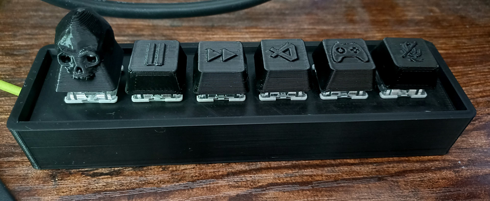
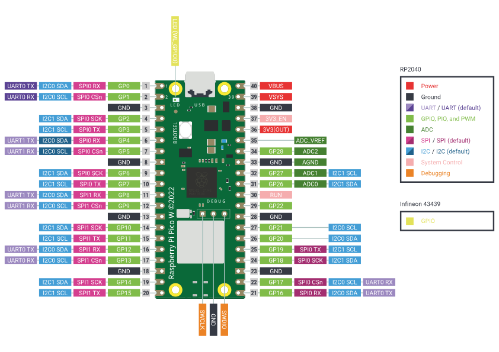

# Macro Keypad Project

This project is a Macro Keypad implementation in Python.



## Description

The Macro Keypad project is designed to provide a simple and customizable keypad interface for various applications using the Pico Pi. It allows users to input commands or trigger actions by pressing specific keys on the keypad. You can customize the 6 keys as you like.

## Requirements

- Raspberry Pi Pico
- Mechanical Key switches (e.g., Cherry MX brown)
- Key Caps (or print them)
- Wires
- 3D printed Case (STL included)
- A soldering iron

## Installation

1. Clone the repository:

    ```shell
    git clone https://github.com/your-username/macro-keypad.git
    ```

## Usage

To use the Macro Keypad, follow these steps:

1. Build the Macro Keypad:
    - Solder all top left pins together for the 3.3 volt connection.
    - Solder the other pins to the GPIO pins on the Raspberry Pi as desired (don't forget to update the code accordingly).

    
    
2. Print the case, the switch holder, and the keycaps.
    - You can also use your own keycaps if you prefer.
    - [Download STL File](3dModels\macro.stl)
    
    ###
    - [Download STL File](3dModels\keycapsAllHigh.stl)
    
    ###
3. Assemble the components together.

4. Connect your Macro Keypad to your computer.

5. The code.py file will automatically run.

6. Press the keys on the keypad to trigger the assigned actions.


## License

This project is licensed under the [MIT License](LICENSE).